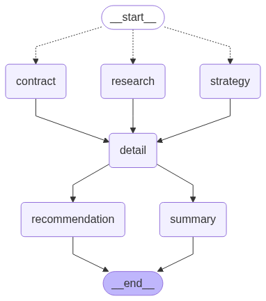

# 👨‍⚖️ AI Legal Agent Team

A Streamlit application that simulates a full-service legal team using multiple AI agents to analyze legal documents and provide comprehensive legal insights. Each agent represents a different legal specialist role, from research and contract analysis to strategic planning, working together to provide thorough legal analysis and recommendations.

## Features

- **Specialized Legal AI Agent Team**
  - **Legal Researcher**: Provides detailed research summaries with sources and references specific sections from uploaded documents.
  
  - **Contract Analyst**: Specializes in thorough contract review, identifying key terms, obligations, and potential issues. References specific clauses from documents for detailed analysis.
  
  - **Legal Strategist**: Focuses on developing comprehensive legal strategies, providing actionable recommendations while considering both risks and opportunities.
  
  - **Team Lead**: Coordinates analysis between team members, ensures comprehensive responses, properly sourced recommendations, and references to specific document parts. Acts as an Agent Team coordinator for all three agents.

- **Document Analysis Types**
  - Contract Review - Done by Contract Analyst
  - Legal Research - Done by Legal Researcher
  - Risk Assessment - Done by Legal Strategist, Contract Analyst
  - Compliance Check - Done by Legal Strategist, Legal Researcher, Contract Analyst
  - Custom Queries - Done by Agent Team - Legal Researcher, Legal Strategist, Contract Analyst

## Langgraph Agent Diagram



## How to Run

1. **Setup Environment**
   ```bash
   # Clone the repository
   git clone [https://github.com/Shubhamsaboo/awesome-llm-apps.git](https://github.com/lokeshparab/AI-Legal-Agent.git)
   cd AI-Legal-Agent
   ```
   * Using `Pypi` Library
     ```bash
     pip install -r requirements.txt
     ```
   * Using `UV` Library
      ```bash
      pip install uv
      uv install python 3.10 
      uv add -r requirements.txt --python 3.10
      ```

2. **Configure API Keys**
   - Get Groq API key from [GroqCloud Platform](https://console.groq.com/keys)
   - Get Jina API key (for Embedding purpose) [Jina Embedding](https://jina.ai/embeddings/)

3. **Run the Application**
   ```bash
   streamlit run legal_agent_team.py
   ```
4. **Use the Interface**
   - Enter API credentials
   - Upload a legal document (PDF)
   - Select analysis type
   - Add custom queries if needed
   - View analysis results

## Notes

- Supports PDF documents only
- Uses GPT-4o for analysis
- Uses text-embedding-3-small for embeddings
- Requires stable internet connection
- API usage costs apply
